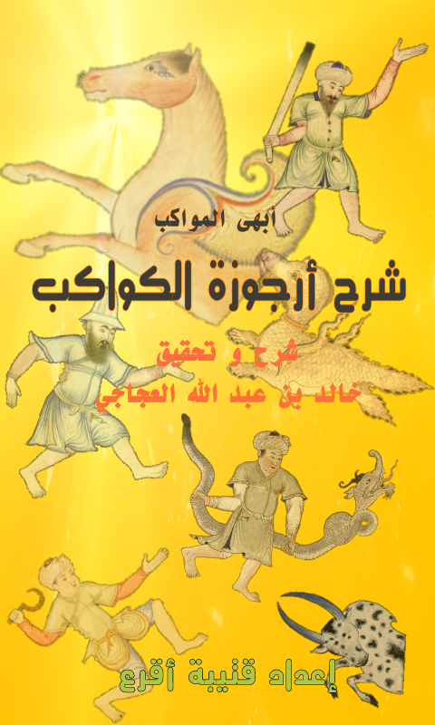

# urjuzah
#أبهى المواكب شرح أرجوزة الكواكب

<h2>بسم الله الرحمن الرحيم</h2>

السلام عليكم ورحمة الله وبركاته، والحمدلله الذي
 جعل في السماء بروجاً وزينها للناظرين.

<strong>"أبهى المواكب شرح أرجوزة الكواكب"</strong> هو موقع مخصص لشرح الأرجوزة الفلكية لابن الصوفي، حيث وجدت أن هذه المنظومة تصف جميع كوكبات ونجوم السماء التي يراها أهل الجزيرة العربية وماحولها وما حاذاها، وشرحها كفيل بتعريف القاريء على كل نجوم 
السماء التي ذكرها العرب والإغريق.

<h1> "التعريف بالأرجوزة الفلكية و قائلها" 	</h1>

هذه الأرجوزة نظمها<b> أبو علي حسين بن الصوفي</b> وهو ابن الفلكي الشهير <b>أبي الحسين عبدالرحمن بن عمر بن محمد بن سهل الرازي المعروف بالصوفي</b>، صاحب كتاب صور الكواكب الثابتة. وقد عاش ناظمها إلى أوائل القرن الخامس الهجري، حيث توجد مخطوطة قام بنسخها لكتاب والده يعود تاريخها إلى سنة 400 هـ في مكتبة بودليان بجامعة أكسفورد.
ويبدو أن الغرض من نظم هذه الأرجوزة هو تلخيص كتاب صور الكواكب الذي وضعه والده، وقد ذكر أنه نظمها لأحد الحكام البويهيين، ويدعى أبي المعالي فخر دين الله.
وهو ينحى نفس منوال كتاب صور الكواكب في الترتيب، ويأخذ أسماء النجوم منه، فيصف كل كوكبة وماورد عن العرب في أسماء نجومها.

الأرجوزة تحوي أكثر من 500 بيت، وتبدأ بمقدمة ثم تذكر الكوكبات مرتبة كالترتيب التالي وسوف أقوم بمشيئة الله بشرح وإيضاح كل كوكبة في موضوع مستقل. وقد أسميت هذا الشرح "أبهى المواكب شرح أرجوزة الكواكب" من باب الاستظراف وليس من باب الفخر، ويمكن أيضاً تسميته "الدراري الملكية شرح الأرجوزة الفلكية".

 
<h1> " المطبوع والمخطوط من الأرجوزة" </h1>

رصدت الدكتورة مويا كيري الباحثة في الفن الإسلامي 18 مخطوطة تحتوي على هذه الأرجوزة إما بشكل مستقل أو ملحقة بمخطوطة لكتاب صور الكواكب. وهذه المخطوطات موجودة في إيطاليا والفاتيكان وألمانيا وتركيا وإنجلترا ومصر وإيران والولايات المتحدة وتونس وفرنسا، ولكن أقدمها موجود في متحف الفن الإسلامي في قطر وتاريخها 519 هـ.

والأرجوزة مطبوعة من ضمن كتاب صور الكواكب الثمانية والأربعين الذي طبعته دائرة المعارف العثمانية في حيدر آباد الدكن عام 1373 هـ وأعادت طبعه دار الآفاق الجديدة عام 1401 هـ، وللأسف ففيها الكثير من التصحيف والأخطاء مع عدم إغفال المجهود الكبير في إخراجها.

ولقد وجدت مخطوطة في جامعة الملك سعود ليست مذكورة في قائمة المخطوطات عند الدكتورة مويا كيري، وهي مخطوطة جميلة مزينة ببرواز مذهب، وتاريخ نسخها هو رجب من سنة 914 للهجرة.

 
<h1>" المخطوطات الموجودة على الشبكة "</h1>

يمكن تصفح ثلاث مخطوطات على الشبكة على الروابط التالية:
<ol>
<li><a href="http://makhtota.ksu.edu.sa/makhtota/202/1" rel="external">مخطوطة جامعة الملك سعود</a></li>
<li><a href="http://gallica.bnf.fr/ark:/12148/btv1b8406153d/f12.image.r=.langEN" rel="external">مخطوطة المكتبة الفرنسية الوطنية رقم Arabe 2492</a></li>
<li><a href="http://pudl.princeton.edu/objects/z603qx459" rel="external">مخطوطة جامعة برنستون</a></li>
</ol> 

والأرجوزة موجودة من ضمن كتاب صور الكواكب للصوفي
ولقد نسخت الأرجوزة من <a href="http://pudl.princeton.edu/objects/z603qx459" rel="external">مخطوطة جامعة برنستون</a> ، مع الرجوع إلى مخطوطتي جامعة الملك سعود ومخطوطة المكتبة الفرنسية والمطبوعة ضمن كتاب صور الكواكب الثمانية والأربعين الذي نشرته دار الآفاق الجديدة، والاستعانة بصور لبعض الصفحات من مخطوطة في طهران والدوحة وردت في مقال للدكتورة مويا كيري في الكتاب السنوي Muqaranas.

وأرجو أن تكون النسخة التي كتبتها لكم أصح من المطبوع، حيث أني أرجع أيضاً للكتب الفلكية التراثية والمعاجم والبحوث السابقة ولحوالي أربع مخطوطات مختلفة من كتاب صور الكواكب الثابتة في تصحيح أسماء النجوم الواردة سواءاً في المخطوط أو المطبوع يقول أبو علي حسين بن الصوفي في مقدمة الأرجوزة:

 
   <table dir="rtl">
<tr> <!-- البيت الأول --><td>باســـم الأله العادل الموحــد</td><td>ورحمة الله على محمــــــد</td></tr>
<tr> <!-- البيت الثاني --><td>هذا مقـــال   لأبــــي علـــي</td><td>نجل أبي الحسين الصـوفي</td></tr>    
<tr> <!-- البيت الثالث --><td>يا سائلي عن فلك الكواكــب</td><td>و ما الذي يحوي من العجــائب</td></tr>
<tr> <!-- البيت الرابع --><td>سألت عنه غير ذي جهل به</td><td>مضيف آداب إلى منصبــــــه</td></tr>
<tr><!-- البيت الخامس --><td>فهاك نعت الفلك العظيــــــم</td><td>وكل ما يحوي من النجـــــوم</td></tr>
    </table>

أرجو أن تجدوا في هذا الشرح الفائدة والمتعة
 
خالد بن عبدالله العجاجي 

<h3>الصور التوضيحية</h3>

الشروحات ستكون مرفقة بصور توضيحية، معظمها من <a href="http://www.stellarium.org/" rel="external">برنامج ستيللاريوم الفلكي المجاني</a>. 

صور الكوكبات هي من ثقافة فلكية موجودة من ضمن البرنامج، قام بإعدادها الأخ الأستاذ <a href="http://www.facebook.com/kutaibaa.akraa" rel=" external ">قتيبة أقرع</a>، باعتماد صور الكوكبات الثمانية والأربعين في <a href="http://gallica.bnf.fr/ark:/12148/btv1b60006156/f8.image.r=.langEN" rel="external ">مخطوطة ألغ بيك الموجودة في المكتبة الفرنسية الوطنية برقم Arabe 5036</a>.هذه الثقافة الفلكية والصور موجودة في إصدارات برنامج ستيللاريوم 0.11.1 ومابعده.

يستحسن استخدام هذا البرنامج مع هذه الثقافة الفلكية لمتابعة هذا الشرح.

<h1>ملاحظات هامة</h1>

	هذه الصفحات تم إنشاؤها باستخدام مكتبة JQuery Mobile 1.3 حيث تم مراعاة التصميم ليعمل على أجهزة الهاتف المحمول و التاب و غيره.و من المفضل أن يتم تصفح هذا الموقع بأجهزة الهاتف المحمول و هذا في الأساس مكتوب بلغة JQuery Mobile 1.3  التي تناسب أجهزة الهاتف المحمول و ظهور الصفحات و الصور و الزووم يعمل بشكل أفضل في المتصفحات داخل الموبايل. 

تم إنشاء هذه النسخة من الموقع بعد أخذ موافقة الأستاذ خالد العجاجي و هي تصلح للتصفح على معظم أجهزة الهاتف المحمول و الشاشات الصغيرة.

 تصفح الموقع الأصلي على الرابط:

<a href="http://sites.google.com/site/urjuzatalkawakib/" rel="external">أبهى المواكب في شرح أرجوزة الكواكب</a>شرح و تحقيق خالد العجاجي

	<h4>قتيبة أقرع</h4>

يمكنك تصفح الموقع من الرابط التالي : <a href="https://kutaibaa-akraa.github.io/urjuzah/" rel="external">" شرح أرجوزة الكواكب "</a>

